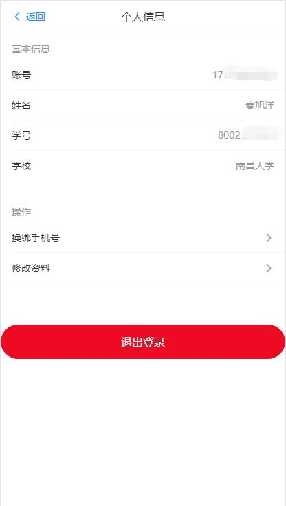
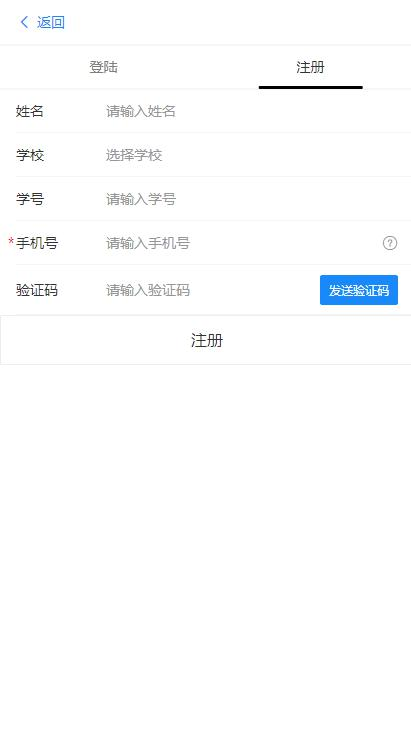
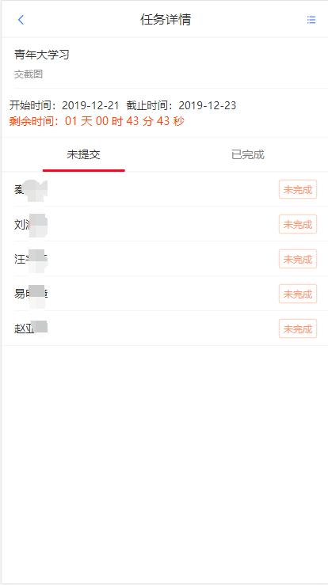

# FileCollection文件收集系统
> **大家都是程序员，希望大佬不要搞我的后台接口（跪下）。另外如果觉得还行的话，可以给个小星星鼓励下么，感谢**
## 一、简介
### 1. 思路
鉴于班长，团支书等班干部在收集材料（例如**青年大学习截图**）时，经常需要在群里@**全体成员**，
我决定开发这样一个轻量级的文件收集系统，帮助班干部完成任务，减轻他们的压力。
最开始只是和大家闲聊谈到，但后来觉得挺有意思的，可以做，于是还真的就一发不可收拾了。
熬夜写（累崩）QAQ，不过兴趣是最好的老师，在这个过程中学会了很多新知识。

### 2. 前端状况
#### ①主要工具：
1. 前端主要使用Vue框架，Vuex状态管理，Vue-Router路由管理，辅以lodash库和ES6新特性进行组件化开发，使用webpack打包项目。
2. UI方面使用Vue移动端组件库Vant，采用stylus预处理器编译CSS代码，除组件原生样式外暂时未做太多布局，重点开发业务逻辑。
3. 使用vue-persistedstate进行本地状态持久化存储，自己编写storage.js进行localstorage加密处理，防止刷新丢失数据并保证数据安全。
4. 使用axios，qs包封装请求，处理请求字符串（**q**uery**s**tring）
5. 使用js-cookie包管理cookie，读取登陆状态等

#### ②已完成功能点如下：
1. 常规的登陆，注册，修改资料等
2. 登陆状态管理，用户信息存储。
3. 发布任务功能
4. 待提交任务清单，也就是每个人需要完成的任务

#### ③待完成大功能点有：
1. 文件上传功能，下载功能
2. 头像上传和更换
3. 界面进一步美化，代码模块组织

注：目前还处于1.0版本开发阶段，实际上还不到1.0，大概有0.7的样子。暂时只做图片的提交。
后期版本，逐步完善之后，可以拓展可上传文件种类，例如文档类型，最常见的就是实验报告等材料。
### 3. 后端状况
#### ①主要工具：
1. 主要使用nodejs完成，使用Express框架搭建服务器，使用ES6，CommandJS标准进行模块化开发。
2. 基于HTTPS协议，但开发阶段暂时使用HTTP协议
3. 使用mongoose包连接并操作MongoDB数据库，存储用户数据，包括会话，用户基本信息，任务信息
4. 使用q模块封装数据库操作（DAO），返回promise对象
5. 使用body-parser解析post请求体
6. 使用jsonwebtoken颁发令牌，访问项目需要携带令牌，进行身份验证
7. 使用multer包实现文件上传，但考虑到服务器带宽问题，后期决定将文件托管至云服务
8. 使用xlsx包读取表格中的大学信息，并生成json文件用于提供大学信息
9. ~~使用express-session，cookie-parser，配合connect-mongo持久化用户会话信息，借助会话限制个别接口的访问~~

### 二、说明
这是我第一次正儿八经的开发一个系统，前后端都要负责的情况下，真的要考虑很多问题。在开发的过程中，很多以前不熟悉，
但又很常用的模块，例如promise，async，await，cookie等基本已经熟练掌握。在逐渐理解设计原则与设计模式的过程中，
项目经历了一次又一次的重构，但每一次重构，都是一次进步，我也很享受这个过程，毕竟独自开发，遇到问题需要不同的翻书，
这本身就是一个学习的过程，这也让我对js这门语言的喜爱逐渐加深。以前买的《深入浅出nodejs》，
《ES6标准入门》等书借此机会又温习了一下。

在这里其实也要建议要就业的同学，一定要早作打算，尤其是像前端开发这样的职位，几乎所有的前端都是自学来的，
学校里相关课程几乎没有，顶多也就是html，css，js的一点皮毛知识。我其实还挺后悔的，大二下学期了才开始醒悟。
要是能早点找到自己的兴趣，早点开始，现在说不定是个小牛了，哈哈

另外，后端代码涉及数据库账号密码，还有https的证书等暂时不方便公开，但是后端接口我是部署好了的，项目文件夹src下的api.js里面
**将localhost替换为域名biubiubius.com即可**，希望各位不要瞎搞奥，验证码要钱的咧。

### 三、起步

``` bash
# 安装依赖包
npm install

# 将项目部署到 0.0.0.0:5000
npm run dev

# build for production and view the bundle analyzer report
npm run build --report
```

### 四、相关截图









